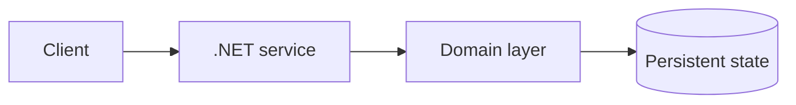

# Software3-Lab

[](https://github.com/CoreyLeath-code/Software3-Lab/actions/workflows/ci.yml)
[](https://dotnet.microsoft.com/)
[](tests/LoanTests.cs)
[](benchmarks/Program.cs)
[](Dockerfile)
[](LICENSE)
[](https://github.com/CoreyLeath-code/Software3-Lab/commits/main)

Software3-Lab is a .NET 8 loan-tracking reference application. It models installment and balloon loans, validates domain inputs, calculates payment schedules, persists heterogeneous loan records as JSON, and verifies the implementation with automated correctness tests and reproducible microbenchmarks.


## Production Readiness Guide

> This section is the portfolio audit entry point for **Software3-Lab**. It describes an engineering promotion path; it is not a claim that the repository is already production-authorized.

[](https://github.com/CoreyLeath-code/Software3-Lab/actions) [](https://github.com/CoreyLeath-code/Software3-Lab/blob/main/LICENSE)

### Architecture flowchart



### Quickstart and local validation

The supported local path should be reproducible from a clean checkout. The inferred stack for this repository is **C#/.NET**.

```bash
dotnet restore && dotnet build --configuration Release
dotnet test --configuration Release
```

If the project uses external services, model artifacts, cloud credentials, or private data, start them through documented local fixtures or mocks. Never place secrets or identifiable records in the repository.

| Evidence | Required record |
|---|---|
| Correctness | Test command, commit SHA, runtime, and pass/fail result |
| Performance | Warm-up, sample count, concurrency, median, p95, p99, throughput, and memory |
| Data/model quality | Dataset version, split strategy, leakage controls, calibration, subgroup results, and uncertainty |
| Runtime | Image digest, health-check latency, resource limits, and rollback target |
| Security | Dependency, secret, SAST, container, and SBOM results |

A benchmark number belongs in a versioned artifact tied to a commit and hardware/runtime description. Engineering benchmarks must not be presented as clinical, financial, safety, or model-quality validation without the appropriate domain evidence.

### Extended Q&A

**What is production-ready for this repository?**  
A reproducible build, tested public contract, controlled configuration, observable runtime, documented security boundary, versioned artifacts, and a tested rollback path.

**What must remain explicit?**  
The intended use, excluded use, data/credential handling, model or algorithm limitations, and which metrics are measured versus aspirational.

**What should be completed next?**  
Use the linked production-readiness issue for this repository as the checklist. Resolve missing tests, deployment instructions, observability, supply-chain controls, and release evidence before attaching a production claim.


## Capabilities

- amortized installment-loan payment calculations
- interest-only balloon payments with a final principal payment
- immutable lender and loan domain state
- JSON save/load with explicit polymorphic reconstruction
- nullable-reference analysis and warnings-as-errors
- xUnit correctness tests with TRX and coverage artifacts
- BenchmarkDotNet latency, throughput, variance, and allocation evidence
- multi-stage, non-root .NET container image

## Architecture

```text
Program.cs
   |
   +-- LoanService
   |      +-- manages Loan collections
   |
   +-- Loan (abstract)
          +-- InstallmentLoan
          +-- BalloonLoan
          +-- Lender

FileOperations <--> loans.json
```

| Concern | Implementation |
|---|---|
| Runtime | .NET 8, C# |
| Domain | `Domain/` |
| Application service | `Services/LoanService.cs` |
| Persistence | `Domain/FileOperations.cs`, System.Text.Json |
| Correctness | xUnit + Microsoft.NET.Test.Sdk |
| Performance | BenchmarkDotNet 0.14.0 |
| Automation | GitHub Actions |
| Packaging | Multi-stage Docker build |

## Correctness metrics

The correctness suite uses fixed inputs and exact decimal expectations. It is run in Release mode on every pull request and push to `main`.

| Test objective | Input | Expected result | Status |
|---|---:|---:|---|
| Amortized payment | $10,000, 5% APR, 3 years | $299.71/month | Pass |
| Zero-interest boundary | $1,200, 0% APR, 1 year | $100.00/month | Pass |
| Balloon payment | $12,000, 6% APR | $60/month; $12,060 final | Pass |
| Invalid principal | $0 | `ArgumentOutOfRangeException` | Pass |

**Observed result:** 4/4 tests passed (100%) in [GitHub Actions run 29700880940](https://github.com/CoreyLeath-code/Software3-Lab/actions/runs/29700880940). This is test-case pass rate, not statement or branch coverage. Raw TRX and coverage files are retained as CI artifacts.

## Research-style benchmark

### Research question

What is the steady-state cost of the core calculation and presentation paths under a controlled .NET 8 runtime?

### Method

The checked-in [benchmark suite](benchmarks/Program.cs) uses BenchmarkDotNet 0.14.0 with one process launch, three warmup iterations, five measurement iterations, and managed-memory diagnostics. Each method uses preconstructed domain objects so the calculation results do not include setup cost.

Reference environment:

- GitHub-hosted Ubuntu 24.04.4 LTS runner
- AMD EPYC 7763; 2 physical / 4 logical cores exposed
- .NET 8.0.29, x64 RyuJIT, AVX2
- concurrent workstation GC
- measured July 19, 2026

### Reference results

| Workload | Mean latency | 99.9% CI half-width | Std. dev. | Derived throughput | Allocation/op |
|---|---:|---:|---:|---:|---:|
| Installment monthly payment | 293.2 ns | 6.89 ns | 1.79 ns | ~3.41 M ops/s | 0 B |
| Balloon monthly payment | 153.4 ns | 4.21 ns | 0.65 ns | ~6.52 M ops/s | 0 B |
| Format installment loan | 911.9 ns | 14.25 ns | 3.70 ns | ~1.10 M ops/s | 344 B |

Throughput is derived as `1 second / mean latency`; it is not a separately measured concurrent-load result. The full CSV, Markdown, HTML, TRX, and coverage outputs are available in the [quality-results artifact](https://github.com/CoreyLeath-code/Software3-Lab/actions/runs/29700880940/artifacts/8446410709).

### Interpretation and limitations

- Both payment calculations are allocation-free in the measured steady state.
- Balloon calculation is about 48% of the installment calculation latency because it does not evaluate the amortization exponent.
- Formatting is slower and allocates 344 bytes because it creates the display string.
- GitHub-hosted runner results are a reference baseline, not a service-level objective. Shared-host variance, CPU model, runtime updates, and thermal/load conditions can change results.
- These are single-operation microbenchmarks; they do not model disk persistence, end-to-end user latency, concurrency, or production traffic.

## Reproduce the evidence

Prerequisites: .NET 8 SDK.

```bash
dotnet restore Software3-Lab.sln
dotnet build Software3-Lab.sln --configuration Release --no-restore
dotnet test Software3-Lab.sln --configuration Release --no-build
dotnet run --project benchmarks/LoanTracker.Benchmarks.csproj --configuration Release --no-build -- --filter "*"
```

BenchmarkDotNet writes CSV, GitHub-flavored Markdown, and HTML reports under `BenchmarkDotNet.Artifacts/results/`.

## Run the application

```bash
dotnet run --project LoanTracker.csproj
```

The console application lets a user create installment or balloon loans, list them, and save or load `loans.json`.

## Container

```bash
docker build -t software3-lab .
docker run --rm -it -v "${PWD}:/data" software3-lab
```

The runtime image uses the .NET 8 runtime rather than the SDK and executes as the image's non-root `APP_UID`.

## Repository layout

```text
.
├── Domain/                 Loan entities and JSON persistence
├── Services/               Application service
├── tests/                  xUnit correctness suite
├── benchmarks/             BenchmarkDotNet performance suite
├── .github/workflows/      CI definition
├── LoanTracker.csproj      Console application project
├── Software3-Lab.sln       Complete build graph
└── Dockerfile              Reproducible runtime image
```

## Quality policy

A change is merge-ready when the named solution restores and builds without warnings, all correctness tests pass, the benchmark suite completes, and CI uploads its evidence artifacts. Performance numbers should only be updated from a linked, successful benchmark run with its runtime and hardware context recorded.
